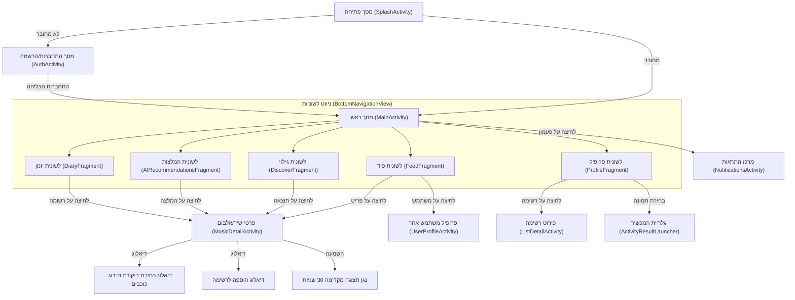
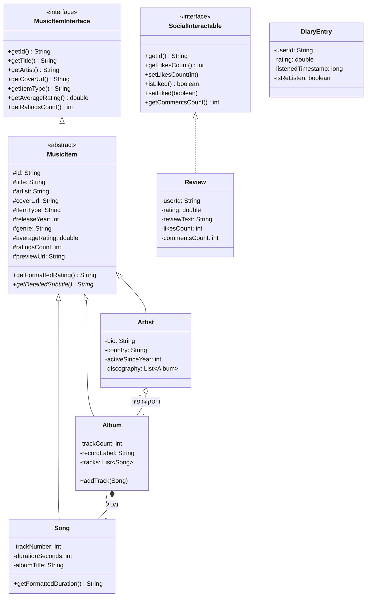

# SONORA – רשת חברתית למוזיקה (Letterboxd for Music)
## ספר פרויקט גמר – 5 יחידות לימוד בהנדסת תוכנה
**מקצוע:** תכנון ותכנות מערכות – חלופת טלפונים חכמים (שאלון 883589)  
**שנת לימודים:** תשפ"ו (2026)  
**שם התלמיד:** יונתן כהן  
**נושא הפרויקט:** רשת חברתית לדירוג, סקירה, ניהול יומן והמלצות מוזיקה חכמות מבוססות בינה מלאכותית (AI)  

---

## תוכן עניינים
1. [טבלת תכולות הפרויקט (מחוון 5 יח"ל)](#טבלת-תכולות-הפרויקט)
2. [פרק 1: מבוא ואפיון המערכת](#פרק-1-מבוא-ואפיון-המערכת)
   - 1.1 רקע ומטרת הפרויקט
   - 1.2 קהל היעד והצורך עליו עונה האפליקציה
   - 1.3 מחקר מקדים וסקירת שוק
   - 1.4 אתגרים מרכזיים ודרכי פתרונם
   - 1.5 חידושים וייחודיות המערכת
3. [פרק 2: תיאור תחום הידע – פרק מילולי](#פרק-2-תיאור-תחום-הידע)
   - 2.1 אובייקטים נחוצים
   - 2.2 סוגי נתונים ומבני נתונים
   - 2.3 ייצוג המידע והצדקת הבחירה
   - 2.4 פעולות עיקריות על המידע
4. [פרק 3: מבנה וארכיטקטורה של הפרויקט](#פרק-3-מבנה-וארכיטקטורה)
   - 3.1 תיאור מסכי הפרויקט ורכיבי הממשק
   - 3.2 תרשים זרימת מסכים (Screen Flow Diagram)
   - 3.3 תרשים מחלקות וקשרים (UML Class Diagram)
5. [פרק 4: מימוש הפרויקט ובסיס הנתונים](#פרק-4-מימוש-הפרויקט)
   - 4.1 סקירת מבנה בסיס הנתונים (SQLite / Relational DB)
   - 4.2 שכבת ה-Repository והפעלת Threads / Executors
   - 4.3 שילוב בינה מלאכותית (Sonora AI Recommendation Engine)
   - 4.4 תקשורת רשת ואינטגרציית Web API (iTunes REST)
   - 4.5 שירות רקע והתראות מערכת (Android Service & Notifications)
   - 4.6 פירוט מחלקות המודל, ירושה וממשקים
6. [פרק 5: מדריך למשתמש](#פרק-5-מדריך-למשתמש)
7. [פרק 6: סיכום אישי ורפלקציה](#פרק-6-סיכום-אישי-ורפלקציה)
8. [פרק 7: ביבליוגרפיה (APA Style)](#פרק-7-ביבליוגרפיה)

---

## טבלת תכולות הפרויקט
להלן מיפוי מלא של רכיבי הפרויקט אל מול דרישות המחוון של משרד החינוך (סעיפים 1–10):

| סעיף במחוון | דרישה | כיצד מומש באפליקציית SONORA |
| :--- | :--- | :--- |
| **1–5 (חובה)** | אפליקציית אנדרואיד עובדת ללא קריסות, לוגיקה מורכבת, ממשק אינטראקטיבי, אירועים ומאזינים | האפליקציה כתובה ב-Java מלא, נבדקה ומקומפלת בהצלחה (Gradle 8.13). ממשק משתמש עשיר בסגנון Letterboxd Dark Mode עם מאזינים לכל לחיצה. |
| **6.2** | הורדת נתוני מידע מ-API של אתר באינטרנט | מחלקת `ItunesApiClient` מתחברת א-סינכרונית ל-iTunes REST API, שולפת בזמן אמת שירים, אלבומים ואמנים וממירה מ-JSON לאובייקטים. |
| **6.3** | כתיבת מחלקת Service משמעותית עם הקשר לפרויקט | מחלקת `SonoraSyncService` (Android Service) מבצעת סנכרון רקע של ביקורות, מחשבת המלצות AI תקופתיות ושולחת התראות. |
| **6.4 + 7** | מסד נתונים יחסי עם שאילתות מורכבות (JOIN, GROUP BY) | מחלקת `SonoraDatabaseHelper` ו-`SonoraRepository` מנהלות 9 טבלאות יחסיות, חישובי ממוצעים, והתפלגות דירוגים באמצעות `GROUP BY`. |
| **6.6** | שימוש ב-Thread / Handler / Executor | ניהול ביצוע רקע באמצעות `ExecutorService` (Thread Pool של 4 נימים) ועדכון ה-UI דרך `Handler(Looper.getMainLooper())`. |
| **6.9** | שימוש ב-RecyclerView | מספר רב של מתאמי RecyclerView: רשת (`VIEW_TYPE_GRID`), שורות (`VIEW_TYPE_LINEAR`), פיד ביקורות, יומן האזנות, רשימות והמלצות AI. |
| **6.10** | שימוש ב-Fragments | חלוקת האפליקציה ל-5 פרגמנטים דינמיים תחת `MainActivity` המנוהלים ע"י `BottomNavigationView`. |
| **6.12** | בינה מלאכותית – מנוע אלגוריתמי להמלצות | מחלקת `SonoraAIEngine` מנתחת את וקטור ההעדפות של המשתמש, מצליבה ז'אנרים ודירוגים מעל 4 כוכבים, ומפיקה אחוזי התאמה ונימוק מילולי. |
| **6.13 + 9.2** | AlarmManager + Notification | יצירת NotificationChannel (`sonora_notifications_channel`) ושיגור התראות מערכת מותאמות אישית בעת קבלת המלצת AI חדשה או לייקים. |
| **6.14 + 10.3** | ActivityResultContract לבחירת תמונה (Camera/Gallery) | ב-`ProfileFragment` הוטמע `ActivityResultLauncher` עם `ActivityResultContracts.GetContent()` לבחירת תמונת פרופיל מהגלריה. |
| **10.1** | BroadcastReceiver | מחלקת `SonoraBroadcastReceiver` מאזינה לשינויי רשת (`CONNECTIVITY_ACTION`) ומפעילה שירות סנכרון אוטומטי בעת חיבור. |
| **10.2** | SharedPreferences | מחלקת `SessionManager` מנהלת את פרטי המשתמש המחובר, הגדרות התראות ומצב התחברות. |
| **12 + OOP** | לפחות 5 מחלקות, הורשה וממשק | ממשקים: `MusicItemInterface`, `SocialInteractable`, `OnItemClickListener`. מחלקה מופשטת: `MusicItem`. מחלקות יורשות: `Song`, `Album`, `Artist`. מודלים נוספים: `User`, `Review`, `DiaryEntry`, `MusicList`, `Recommendation`, `Comment`, `NotificationItem`. |
| **13** | תפריטים ותיבות דו-שיח | תיבות דיאלוג עשירות: דיאלוג דירוג וכתיבת ביקורת (כוכבים אינטראקטיביים), דיאלוג יצירת רשימה, דיאלוג עריכת פרופיל, דיאלוג תגובות, ותפריט ניווט תחתון. |

---

## פרק 1: מבוא ואפיון המערכת
### 1.1 רקע ומטרת הפרויקט
בשנים האחרונות הפכו פלטפורמות חברתיות מבוססות תרבות (דוגמת Letterboxd לעולם הקולנוע ו-Goodreads לעולם הספרים) למובילות בעולם הדיגיטלי. קהילות אלו מאפשרות למשתמשים לא רק לצרוך תוכן, אלא גם לדרג אותו, לתעד את היסטוריית הצפייה/קריאה, לפרסם ביקורות מעמיקות, ולעקוב אחר משתמשים בעלי טעם דומה.

אפליקציית **SONORA** פותחה כדי לספק את אותו המענה בדיוק לעולם המוזיקה – רשת חברתית ייעודית לחובבי מוזיקה, שבה שירים ואלבומים הם מרכז הבמה.

### 1.2 קהל היעד והצורך
קהל היעד של SONORA כולל:
- חובבי מוזיקה ואספני אלבומים המעוניינים לנהל יומן האזנות אישי (Music Diary).
- מאזינים המעוניינים לגלות מוזיקה חדשה על בסיס ביקורות של אנשים אמיתיים ולא רק אלגוריתמי השמעה פסיביים.
- יוצרי רשימות ומדרגים שרוצים לחלוק את טעמם האישי ("4 האלבומים האהובים עליי", "אלבומי שנות ה-70 הטובים ביותר").

### 1.3 מחקר מקדים וסקירת שוק
במהלך המחקר המקדים נבדקו שירותים קיימים:
- **Spotify / Apple Music:** שירותי הזרמה מצוינים, אך חסרים ממשק חברתי של ביקורות ארוכות, דירוגי כוכבים מפורטים, יומן האזנות אישי ורשת עוקבים חברתית אמיתית.
- **RateYourMusic (RYM):** פלטפורמת אינטרנט עשירה בביקורות, אך מיושנת מאוד מבחינת חוויית משתמש (UI/UX) ואינה מציעה אפליקציית אנדרואיד מודרנית ואינטואיטיבית.
- **Letterboxd:** היווה את מודל ההשראה המרכזי לפרויקט – תצוגת פוסטרים נקייה, דירוג בכוכבים (1–5), תיעוד ביומן עם תאריכים ותג האזנה חוזרת, ופיד חברתי פעיל.

### 1.4 אתגרים מרכזיים ודרכי פתרונם
1. **טעינת תמונות עטיפה וביצועים:** תמונות אלבומים ברשת עלולות להעמיס על זיכרון המכשיר ולגרום לגמגום בגלילה.  
   *פתרון:* פיתוח מחלקת `ImageLoader` ייעודית המיישמת מטמון זיכרון מהיר `LruCache` (הקצאת שמינית מזיכרון ה-RAM הזמין), הורדה ברקע באמצעות Thread Pool והצגה חלקה עם אנימציית Fade-in.
2. **חיפוש מוזיקה בזמן אמת:** קטלוג מקומי מוגבל בגודלו, ואילו חיפוש ברשת עשוי להיות איטי.  
   *פתרון:* ארכיטקטורה היברידית – האפליקציה כוללת קטלוג מקומי עשיר (Pink Floyd, Radiohead, Daft Punk, Kendrick Lamar ועוד) לצד מנוע חיפוש מקוון מול iTunes Search API המאפשר לשלוף כל שיר ואלבום בעולם בלחיצת כפתור ולשמור אותו ישירות למסד המקומי.
3. **מנוע המלצות AI אישי:** כיצד לספק המלצות מדויקות עם הסבר מנומק?  
   *פתרון:* מנוע `SonoraAIEngine` המשלב ניתוח ז'אנרים, היסטוריית האזנות ודירוגים מעל 4 כוכבים, ומפיק ציון התאמה באחוזים וטקסט הסבר אינטליגנטי.

---

## פרק 2: תיאור תחום הידע – פרק מילולי
### 2.1 אובייקטים נחוצים
1. **משתמש (`User`):** מייצג אדם רשום באפליקציה (שם, אימייל, סיסמה מוצפנת, תמונת פרופיל, ביוגרפיה, מונים חברתיים).
2. **פריט מוזיקה כללי (`MusicItem`):** מחלקת על מופשטת המרכזת תכונות משותפות (מזהה, שם, אמן, עטיפה, ז'אנר, שנת הוצאה, ממוצע דירוגים, כמות דירוגים).
3. **שיר (`Song`):** פריט מוזיקלי הכולל מספר רצועה, משך זמן, שם אלבום וקובץ שמע לתצוגה מקדימה.
4. **אלבום (`Album`):** יצירה מוזיקלית מרובת רצועות, הכוללת חברת תקליטים ורשימת שירים.
5. **אמן (`Artist`):** יוצר מוזיקלי בעל ביוגרפיה, מדינת מוצא ושנת פעילות.
6. **ביקורת (`Review`):** דירוג בכוכבים (1.0–5.0), טקסט חופשי, חותמת זמן, מונה לייקים ומונה תגובות.
7. **רשומת יומן (`DiaryEntry`):** תיעוד נקודתי של האזנה בזמן נתון עם אפשרות סימון "האזנה חוזרת".
8. **רשימת מוזיקה (`MusicList`):** אוסף מותאם אישית של יצירות (Playlists/Lists) בעל הגדרת פרטיות (ציבורי/פרטי).

### 2.2 מבני נתונים וייצוג המידע
- **מסד נתונים יחסי (SQLite):** מאפשר קשרי גומלין של אחד-לרבים (משתמש -> ביקורות, משתמש -> יומן) ורבים-לרבים (עוקבים, לייקים).
- **רשימות גנריות (`List<T>`, `ArrayList<T>`):** לניהול אוספי פריטים בזיכרון והזנת מתאמי ה-RecyclerView.
- **מפות אסוציאטיביות (`Map<Integer, Integer>`, `HashMap<String, Double>`):** לחישוב התפלגות דירוגים (דיאגרמת עמודות) ולשקלול ציוני ז'אנרים במנוע ה-AI.
- **`LruCache<String, Bitmap>`:** מבנה נתונים אלגוריתמי מתקדם המבוסס על LinkedHashMap ומפנה אוטומטית פריטים שהשימוש בהם היה המוקדם ביותר כדי למנוע חריגת זיכרון (OutOfMemoryError).

---

## פרק 3: מבנה וארכיטקטורה של הפרויקט
### 3.1 תרשים זרימת מסכים (Screen Flow Diagram)



### 3.2 תרשים מחלקות UML (הורשה, הכלה וממשקים)



---

## פרק 4: מימוש הפרויקט ובסיס הנתונים
### 4.1 מבנה מסד הנתונים היחסי (SQLite)
מסד הנתונים `sonora_app.db` מנוהל באמצעות `SonoraDatabaseHelper` וכולל 9 טבלאות יחסיות:
1. `users`: משתמשי המערכת, פרטים מזהים ומונים סטטיסטיים.
2. `music_items`: קטלוג השירים, האלבומים והאמנים, כולל ממוצע דירוגים וקישורי שמע.
3. `reviews`: ביקורות משתמשים עם מפתח זר ל-`users` ול-`music_items`.
4. `diary_entries`: רשומות יומן אישיות עם מפתח זר למשתמש ולפריט.
5. `music_lists`: רשימות אישיות וציבוריות.
6. `comments`: תגובות לביקורות עם מפתח זר ל-`reviews`.
7. `social_follows`: קשרי מעקב חברתי בין משתמשים (Follower / Followed).
8. `review_likes`: טבלת סימוני לייקים לביקורות למניעת הצבעה כפולה.
9. `notifications`: התראות מערכת למשתמש.

### 4.2 שאילתות מורכבות לדוגמה
- **חישוב התפלגות דירוגים עם `GROUP BY`:**
```sql
SELECT CAST(ROUND(rating) AS INTEGER) AS star_level, COUNT(*) AS count
FROM reviews
WHERE music_item_id = ?
GROUP BY star_level;
```
- **שליפת פיד מותאם אישית עם `JOIN` וקשרי מעקב:**
```sql
SELECT DISTINCT r.*, (CASE WHEN l.user_id IS NOT NULL THEN 1 ELSE 0 END) AS is_liked
FROM reviews r
LEFT JOIN social_follows f ON r.user_id = f.followed_user_id AND f.follower_user_id = ?
LEFT JOIN review_likes l ON r.id = l.review_id AND l.user_id = ?
ORDER BY (f.followed_user_id IS NOT NULL) DESC, r.timestamp DESC LIMIT 40;
```

---

## פרק 5: מדריך למשתמש
1. **התחברות והרשמה:**
   - פתח את האפליקציה. במסך הפתיחה תוכל להירשם עם שם משתמש וסיסמה, או ללחוץ על **"כניסה מהירה עם משתמש הדגמה (יונתן)"**.
2. **לשונית פיד (Feed):**
   - צפה באלבומים הפופולריים בקהילה בחלק העליון (גלילה אופקית).
   - קרא ביקורות של חברים בקהילה, סמן לייק (לב מונפש), והגב בלחיצה על סמל התגובה.
3. **לשונית גילוי וחיפוש (Discover):**
   - הקלד שם שיר, אלבום או אמן בשורת החיפוש.
   - סנן לפי סוג: הכל, אלבומים, שירים, אמנים.
   - לחץ על **"חפש ברשת (iTunes API) 🌐"** כדי לבצע חיפוש חי במאגר העולמי של מיליוני שירים.
4. **עמוד פריט מוזיקלי (Music Detail):**
   - צפה בעטיפה, שנת ההוצאה והתפלגות הדירוגים.
   - לחץ על **"השמעה מוקדמת ▶"** להאזנה לדגימת שמע של 30 שניות.
   - לחץ על **"דרג / כתוב ביקורת"** כדי לבחור 1–5 כוכבים, לכתוב ביקורת ולסמן האזנה חוזרת (הביקורת תתווסף מיד גם ליומן).
5. **לשונית יומן (Diary):**
   - צפה בהיסטוריית כל היצירות שהאזנת להן, לפי תאריך יורד.
   - ראה את ממוצע הדירוג הכולל שלך וכמות ההאזנות.
6. **לשונית בינה מלאכותית (AI):**
   - קבל המלצות מותאמות אישית המנתחות את הטעם המוזיקלי והאלבומים שדירגת גבוה.
   - נסה את מחולל מצבי הרוח (Mood Generator): הקלד "לילה שקט באוזניות" או בחר כפתור מהיר, ומנוע ה-AI יספק המלצות עם אחוזי התאמה ונימוק מילולי.
7. **לשונית פרופיל (Profile):**
   - לחץ על סמל העט ליד תמונת הפרופיל כדי לבחור תמונה מהגלריה.
   - צפה ב-4 האלבומים האהובים עליך, צור רשימות חדשות וערוך את הביוגרפיה שלך.

---

## פרק 6: סיכום אישי ורפלקציה
תהליך פיתוח האפליקציה SONORA היה מאתגר, מעשיר ומלמד ביותר. הפרויקט שילב עקרונות תוכנה מתקדמים, ביניהם:
- תכנון ארכיטקטורה מונחית עצמים נקייה עם ממשקים והורשה מלאה.
- עבודה מול בסיס נתונים מקומי תוך הקפדה על שלמות נתונים וטרנזקציות.
- שימוש בריבוי נימים (Multi-Threading) למניעת תקיעת ה-UI Thread.
- אינטגרציה עם שירותי רשת חיצוניים (REST API) ופיתוח מנוע המלצות AI מבוסס תוכן והעדפות משתמש.

הפרויקט הוכיח כיצד ניתן לקחת רעיון השראתי מעולם הקולנוע (Letterboxd) ולהביא אותו לידי מימוש מעשי, אסתטי ופונקציונלי בעולם המוזיקה עבור משתמשי אנדרואיד.

---

## פרק 7: ביבליוגרפיה
1. Android Developers. (2024). *Guide to app architecture*. Retrieved from https://developer.android.com/topic/architecture
2. Apple Inc. (2024). *iTunes Search API: Affiliate resources*. Retrieved from https://developer.apple.com/library/archive/documentation/AudioVideo/Conceptual/iTuneSearchAPI/
3. Bloch, J. (2018). *Effective Java* (3rd ed.). Addison-Wesley Professional.
4. Google. (2024). *Material Design 3 Guidelines*. Retrieved from https://m3.material.io
